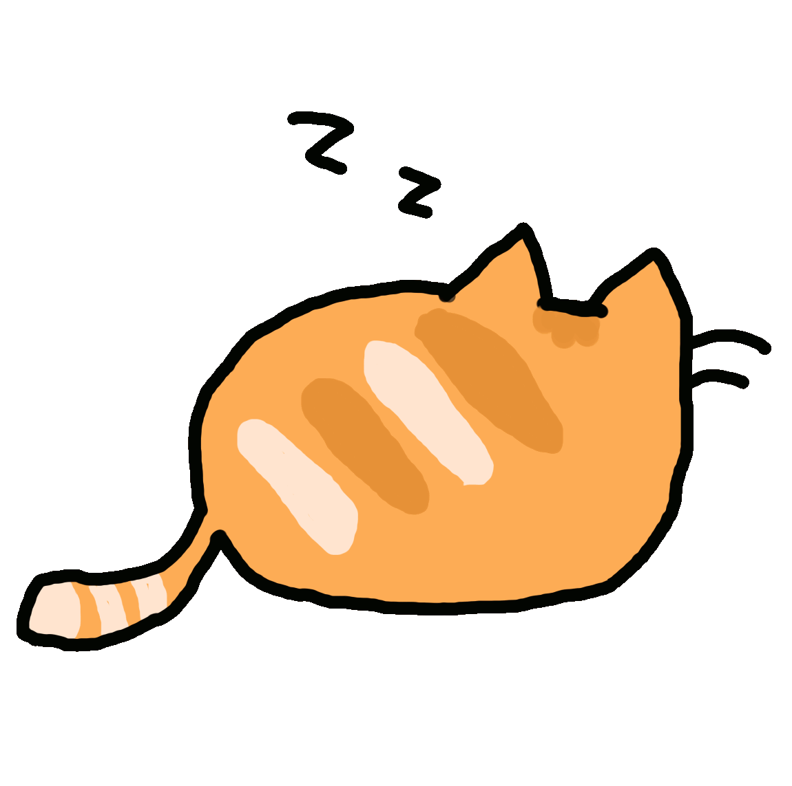
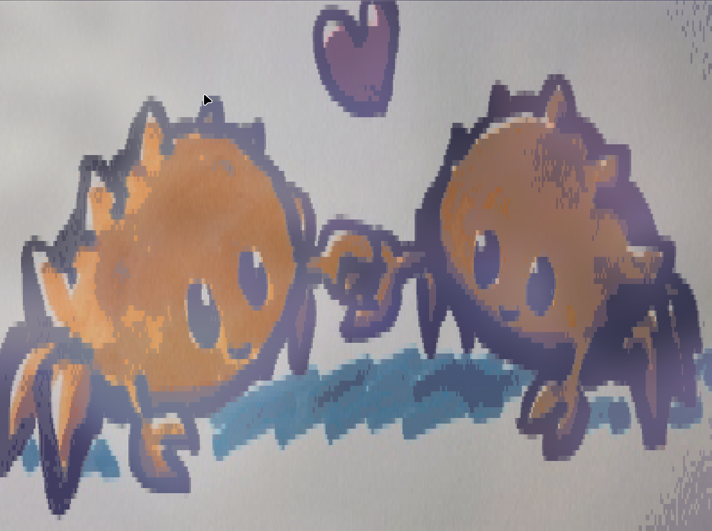

***Welcome to Florian Liao's GitHub page!***

***This orange cat is the mythological animal that guards my github page.***

***I'm an Arch Linux and rust enthusiast, my daily work environment is Arch Linux + [hyprland](https://github.com/huahuadeliaoliao/hua_hyprland_conf)***

- 🔭 I’m currently working on ***[RoseSwitch](https://github.com/huahuadeliaoliao/RoseSwitch)***

- 🌱 I’m currently learning ***linux network programming, solana, x11 and wayland windows protocol***

***ASCII art images generated using [rascii](https://github.com/orhnk/RASCII)***

