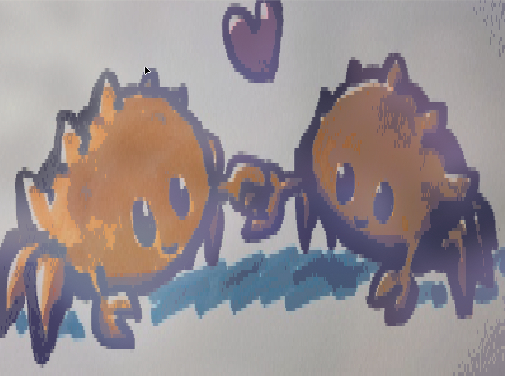

***Welcome to Florian Liao's GitHub profile.***

***This orange cat guards my GitHub profile.***

My work focuses on agent development and LLM inference optimization, including multimodal systems and task-specialized models built on top of large language models. I also occasionally run deep learning training experiments.

I also maintain agent-oriented skills and workflow harnesses that may fit naturally into your own development loop:

- [long-long-run](https://github.com/huahuadeliaoliao/long-long-run) - A session-bound runtime for long-running agent work, evidence-chain exploration, and controlled implementation handoffs.
- [ddgs-search-harness](https://github.com/huahuadeliaoliao/ddgs-search-harness) - A DDGS-based search harness for evidence-first research, source discovery, and compact decision packets.

***ASCII art images generated using [rascii](https://github.com/orhnk/RASCII)***

